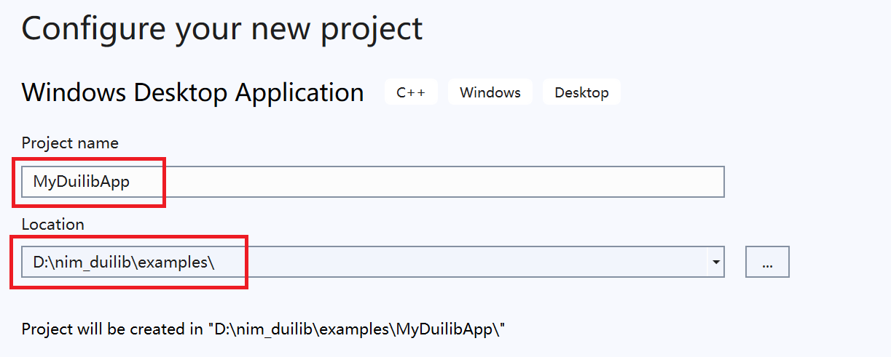
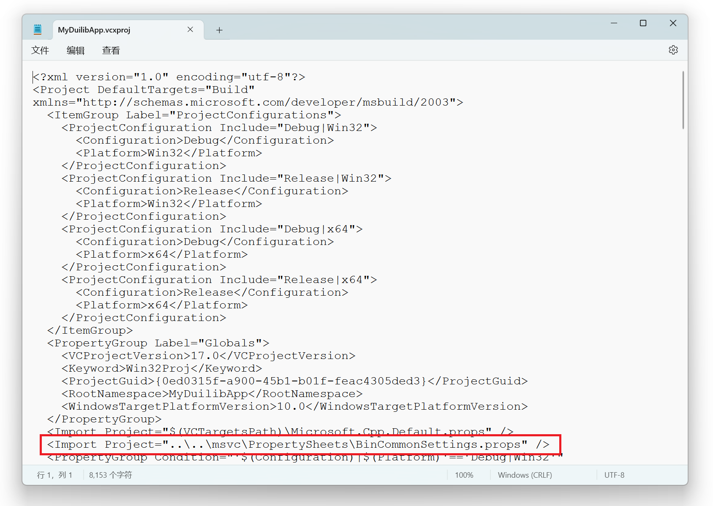
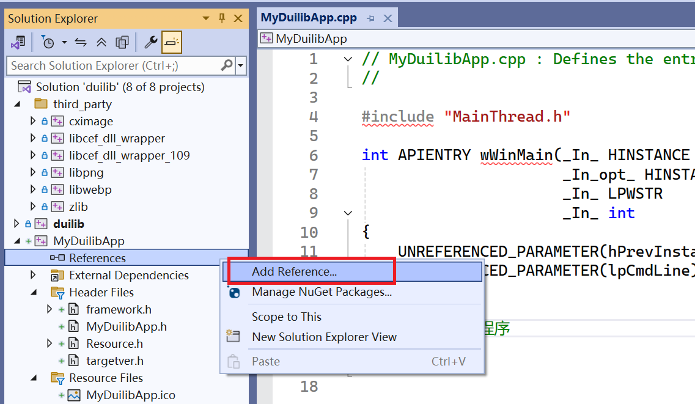

# Quick Start (Windows, VS 2022)

This example will guide you through quickly deploying a basic application based on dui. It is similar to the `basic` project in `examples`; if you prefer to look at the code, you can open the `scripts/examples.sln` solution and refer to the example code without spending extra time.

## Getting the project code and compiling

1. Get the project code

```bash
git clone https://github.com/steveriemannx/dui dui
```

2. Note on dependencies: the dependencies (Skia rendering engine, SDL3, etc.) are vendored in the `third_party` directory and are downloaded/built automatically by the build scripts — no separate manual preparation is needed.
3. In the working directory, the basic directory structure of the source code of the projects is as follows    


4. Compile dui: enter the `dui` directory, open `scripts/examples.sln` with the Visual Studio 2022 IDE, select Debug|x64 or Release|x64 as the build configuration, and press F7 to compile all the example programs (the compiled example programs are located in the bin directory).

## Creating a basic project

Open the `scripts/examples.sln` solution with Visual Studio and create a new Windows desktop application to complete your first program based on the dui UI library step by step.

1. Create a new Windows desktop program in the `scripts/examples.sln` solution (VS2022, program type: Windows Desktop Application).
Assume the program is named: `MyDuiApp`, and its source code is placed in the `examples` subdirectory.    



2. Clean up the generated code. You never write `wWinMain` yourself: the platform entry function (`wWinMain`/`WinMain`/`main`) is generated automatically by the `DUI_APP_ENTRY` macro. Create the `main.cpp` file with the `App` class as described in the "Writing the app entry (main.cpp)" section below.

## Configuring project properties
- Use the common configuration provided by dui (`msvc\PropertySheets\BinCommonSettings.props`)    
(1) Open the project file just created with a text editor (`examples\MyDuiApp\MyDuiApp.vcxproj`)    
(2) Locate the line `<Import Project="$(VCTargetsPath)\Microsoft.Cpp.Default.props" />` and insert a new line after it with the following content:    
         `<Import Project="..\..\msvc\PropertySheets\BinCommonSettings.props" />`    
(3) Save the changes to the project file; if it is already open in VS, reload it.    



- Right-click the project -> Add -> Reference, and add dui, cximage, libpng, libwebp and zlib as referenced projects, so that there is no need to manually add static library files.



After adding them, you can see the successfully referenced projects:    
  

## Writing the app entry (main.cpp)

Every example has a single entry file `main.cpp` that defines the application class `App` (a `ui::FrameworkThread` subclass) and invokes the `DUI_APP_ENTRY` macro. The platform entry function (`wWinMain`/`WinMain`/`main`) is generated automatically by the macro — you never write `wWinMain` yourself.

Create the file `main.cpp` with the following content (create the `MainForm` class first, see the next section):

```cpp
#include "dui/dui.h"
#include "MainForm.h"
#include "dui/Utils/AppEntry.h"

/** App: FrameworkThread subclass that serves as the DUI_APP_ENTRY target.
 *  RunMessageLoop() calls OnInit() -> message loop -> OnCleanup().
 */
class App : public ui::FrameworkThread
{
public:
    App() : FrameworkThread(_T("App"), ui::kThreadUI) {}

    void Run() { RunMessageLoop(); }

private:
    virtual void OnInit() override
    {
        // initialize global resources, using a local folder as the resource
        ui::FilePath resourcePath = ui::FilePathUtil::GetCurrentModuleDirectory();
        resourcePath += _T("resources\\");
        ui::GlobalManager::Instance().Startup(ui::LocalFilesResParam(resourcePath));

        // create a default centered window with a shadow
        MainForm* window = new MainForm();
        window->CreateWnd(nullptr, ui::WindowCreateParam(_T("MyDuiApp"), true));
        window->PostQuitMsgWhenClosed(true);
        window->ShowWindow(ui::kSW_SHOW_NORMAL);
    }

    virtual void OnCleanup() override
    {
        ui::GlobalManager::Instance().Shutdown();
    }
};

DUI_APP_ENTRY(App)
```

Notes:
- Invoke the `DUI_APP_ENTRY(App)` macro exactly once per executable, at global scope, in one `.cpp` file (never in a header).
- `App` must provide a default constructor and a `void Run()` method. If the entry needs `argc`/`argv` (for example a CEF application), use `DUI_APP_ENTRY_ARGS(App)` instead, and `App` must provide `static App& Instance()` and `int Run(int argc, char** argv)`.

## Creating a simple window

Create a window class MainForm that inherits from the `ui::WindowImplBase` class and overrides methods such as `GetSkinFolder` and `GetSkinFile`.

```cpp
//MainForm.h
#ifndef EXAMPLES_MAIN_FORM_H_
#define EXAMPLES_MAIN_FORM_H_

// dui
#include "dui/dui.h"

/** Main window implementation of the application
*/
class MainForm : public ui::WindowImplBase
{
    typedef ui::WindowImplBase BaseClass;
public:
    MainForm();
    virtual ~MainForm() override;

    /**  Called when the window is created; implemented by the subclass to get the window skin directory
    * @return the subclass must implement and return the window skin directory
    */
    virtual DString GetSkinFolder() override;

    /**  Called when the window is created; implemented by the subclass to get the window skin XML description file
    * @return the subclass must implement and return the window skin XML description file
    *         The returned value can be the XML file content (a string starting with '<'),
    *         or a file path (a string not starting with '<') that can be found under the GetSkinFolder() path
    */
    virtual DString GetSkinFile() override;

    /** Called after the window is created, for the subclass to do some initialization work
    */
    virtual void OnInitWindow() override;
};

#endif //EXAMPLES_MAIN_FORM_H_
```

```cpp
//MainForm.cpp
#include "MainForm.h"

MainForm::MainForm()
{
}

MainForm::~MainForm()
{
}

DString MainForm::GetSkinFolder()
{
    return _T("my_dui_app");
}

DString MainForm::GetSkinFile()
{
    return _T("MyDuiForm.xml");
}

void MainForm::OnInitWindow()
{
    BaseClass::OnInitWindow();
    // window initialization is done; the form-specific initialization can now be performed

}
```

## Creating the window description XML file

In the window class we created, the window skin folder is specified as `my_dui_app` and the window skin file as `MyDuiForm.xml`.
Next, create the `my_dui_app` folder under the `bin\resources\themes\default` directory, create a new `MyDuiForm.xml` file in it, and write the following content.    
Note: the encoding format of the XML file is UTF-8.  
```xml
<?xml version="1.0" encoding="UTF-8"?>
<Window size="800,600" mininfo="80,60" 
        caption="0,0,0,36" use_system_caption="false" snap_layout_menu="true" sys_menu="true" sys_menu_rect="0,0,36,36" 
        shadow_type="default" shadow_attached="true" layered_window="true" 
        alpha="255" sizebox="4,4,4,4" icon="../public/caption/logo.ico">
    <VBox bkcolor="bk_wnd_darkcolor" visible="true">    
        <!-- Caption bar area -->
        <HBox name="window_caption_bar" width="stretch" height="36" bkcolor="bk_wnd_lightcolor">
            <Control />
            <Button class="btn_wnd_fullscreen_11" height="32" width="40" name="fullscreenbtn" margin="0,2,0,2" tooltip_text="Fullscreen; press ESC to exit fullscreen"/>
            <Button class="btn_wnd_min_11" height="32" width="40" name="minbtn" margin="0,2,0,2" tooltip_text="Minimize"/>
            <Box height="stretch" width="40" margin="0,2,0,2">
                <Button class="btn_wnd_max_11" height="32" width="stretch" name="maxbtn" tooltip_text="Maximize"/>
                <Button class="btn_wnd_restore_11" height="32" width="stretch" name="restorebtn" visible="false" tooltip_text="Restore"/>
            </Box>
            <Button class="btn_wnd_close_11" height="stretch" width="40" name="closebtn" margin="0,0,0,2" tooltip_text="Close"/>
        </HBox>
        
        <!-- Work area: everything except the caption bar goes into this large Box -->
        <Box>
            <VBox margin="0,0,0,0" valign="center" halign="center">
                <Label name="tooltip" text="This is a simple dui window with a caption bar and normal buttons." height="100%" width="100%" text_align="hcenter,vcenter"/>        
            </VBox>
        </Box>
    </VBox>
</Window>
```

## Showing the window

The window is created in `App::OnInit()` in `main.cpp` (see the "Writing the app entry" section above): initialize the global resources first, then create the window and show it centered. The window destruction is managed by the framework — create with `new`, no manual `delete` needed.

In this way, a simple window with minimize, maximize, restore, close and fullscreen buttons, a shadow effect and a line of text is created. You can compile and run the code to see the window effect.
   
## Using libCEF in the program
You can refer to the related document [CEF.md](CEF.md)

## About Visual Studio project configuration
The Visual Studio project configuration in the project uses property files, stored in the following directory: `dui\msvc\PropertySheets`
    
## How to set the source code file encoding in the project to UTF-8
1. Create a format configuration file in the project root directory, named: .editorconfig
2. The file content is as follows:
```
# Visual Studio generated .editorconfig file with C++ settings.
root = true

[*.{c,c++,cc,cpp,cppm,cxx,h,h++,hh,hpp,hxx,inl,ipp,ixx,tlh,tli}]

# Visual C++ Formatting settings

end_of_line = crlf               # line ending style; possible values are lf (Unix), cr (Mac) or crlf (Windows)
charset = utf-8                  # file character set is UTF-8 (possible values: utf-8, utf-8-bom, latin1, etc.)
trim_trailing_whitespace = true  # remove trailing whitespace at the end of lines
insert_final_newline = true      # insert a final newline at the end of the file
indent_style = space             # use spaces instead of tabs
indent_size = 4                  # number of spaces per indent level
tab_width = 4                    # width of a tab
```
3. This method applies to Visual Studio 2022.
