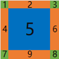

# Global (Global Styles)

The Global style provides a common style list, avoiding redundant code caused by repeating the same descriptions in multiple XML files and saving developers time spent on UI setup.

After calling the GlobalManager::Startup method, [global.xml](../bin/resources/themes/default/global.xml) is looked up under the configured skin resource path as the global style resource. In the existing samples example code,
some preset global styles are included, such as fonts, colors and some common styles.

## 1. Default font names (DefaultFontFamilyNames)
```xml
<!-- Default font names, as a comma-separated list, matched in order until the first valid font is found and used as the default font name -->
<DefaultFontFamilyNames value="Microsoft YaHei,SimSun"/>
```
DefaultFontFamilyNames has only one attribute, value, which is used to set the default font list; different fonts are separated by commas (half-width characters).    
The setting above determines the default font name in the order of Microsoft YaHei and SimSun: if the Microsoft YaHei font exists, it is used as the default font; otherwise SimSun is used.

## 2. Fonts (Font)

If you want to add a font, add the following code to [global.xml](../bin/resources/themes/default/global.xml). After the program starts, all fonts in the list are loaded into the cache, distinguished by their ID.

```xml
<!-- name is the font name, size is the font size, bold specifies whether the text is bold, underline specifies whether it contains an underline -->
<Font id="system_12" name="system" size="12" bold="true" underline="true"/>
```

The id attribute of the Font tag defines a font ID, which represents a set of font attributes: font name, font size, bold, italic, strikethrough and underline. When needed, simply specify the font ID. For example, if you want a Button to use the font with ID `system_12`, you can write:

```xml
<Button text="Hello Button" font="system_12"/>
```
When the UI is displayed, the duilib UI library draws the button's text using the font attributes identified by the font ID "system_12" (font name: system default font; font size: 12; bold: yes; italic: yes).

### All available attributes of Font

| Attribute Name | Default Value | Parameter Type | Purpose |
| :--- | :--- | :--- | :--- |
| id | | string | Font ID |
| name | | string | The name of the font in the system: "system" means the system default font, "Microsoft YaHei" means Microsoft YaHei, and "SimSun" means SimSun |
| size | 12 | int | Font size, for example: 12 corresponds to the "small five" size, 14 to the "five" size, 16 to the "small four" size, 19 to the "four" size, 20 to the "small three" size, 21 to the "three" size |
| bold | false | bool | Whether bold |
| underline | false | bool | Whether underlined |
| strikeout | false | bool | Whether strikethrough |
| italic | false | bool | Whether italic |
| default | false | bool | Whether it is the default font; if no font is specified for a control, this font is used |

For the code that parses font attributes, see the `WindowBuilder::ParseFontXmlNode` function

## 3. Font files (FontFile)
The program can bundle its own font files, which are loaded at program startup and can be used without being installed as system fonts.    
Generally, defining a complete font requires 4 font files: a regular font file, a bold file, an italic file and a bold-italic file.    
For example, to add font files for a font named `Roboto Mono`, add the following code to global.xml:
```xml
<!-- Font files (placed in the fonts directory under the resource root); loaded at program startup; after loading they can be used in the same way as system fonts -->
<FontFile file="RobotoMono-Regular.ttf" desc="Font name: Roboto Mono, regular"/>
<FontFile file="RobotoMono-Bold.ttf" desc="Font name: Roboto Mono, bold"/>
<FontFile file="RobotoMono-Italic.ttf" desc="Font name: Roboto Mono, italic"/>
<FontFile file="RobotoMono-BoldItalic.ttf" desc="Font name: Roboto Mono, bold italic"/>
```
Place the four font files `RobotoMono-Regular.ttf`, `RobotoMono-Bold.ttf`, `RobotoMono-Italic.ttf` and `RobotoMono-BoldItalic.ttf` in the fonts directory of the resource root (bin\resources\fonts). After the program starts, these font files are loaded.    
Once the font files are loaded, the `Roboto Mono` font can be used in the same way as fonts like Microsoft YaHei and SimSun; see the usage described in `2. Fonts (Font)` in this document.

### All available attributes of FontFile

| Attribute Name | Default Value | Parameter Type | Purpose |
| :--- | :--- | :--- | :--- |
| file |      | string | File name of the font file; the font file must be placed in the fonts directory of the resource root|
| desc |      | string | Description of the font file; it has no other purpose|

After the font files are configured, they are used exactly like system fonts (i.e., the font can be specified via the Font tag).

### Example usage of FontFile
In the preceding section, the FontFile tag was used to define a font named `Roboto Mono`. To use it, first define a font ID:
```xml
<!-- name is the font name, size is the font size, bold specifies whether the text is bold, italic specifies whether it is italic -->
<Font id="roboto_mono_12" name="Roboto Mono" size="12" bold="true" italic="true"/>
```
Then use that font ID (`roboto_mono_12`) to set the font attributes of the text in a control.    
For example, to define a button with this font ID, the XML configuration can be written as follows:
```xml
<Button text="Roboto Mono Button" font="roboto_mono_12"/>
```
Note: the Roboto Mono font can only be used to display English letters; it does not support Chinese, so do not use this font to display Chinese text.    

## 4. Colors (TextColor)

You can add commonly used colors to `global.xml` as shown below:

```xml
<!-- name is the color name, value is the color value -->
<TextColor name="default_font_color" value="#ff333333"/>
```

Then, when you need to use this color to set the text color of a Label, you can write:

```xml
<Label text="Hello Label" normal_text_color="default_font_color"/>
```

### All available attributes of TextColor

| Attribute Name | Default Value | Parameter Type | Purpose |
| :--- | :--- | :--- | :--- |
| name | | string | Color name |
| value | | string | Color value|

A valid color value is defined as follows:
1. In the form "#FFFFFFFF": starts with "#" and consists of 8 hexadecimal characters, an ARGB-format color value (from left to right: the 1st and 2nd characters represent A (alpha), the 3rd and 4th represent R (red), the 5th and 6th represent G (green), and the 7th and 8th represent B (blue));
2. In the form "#FFFFFF": starts with "#" and consists of 6 hexadecimal characters, an RGB-format color value (from left to right: the 1st and 2nd characters represent R (red), the 3rd and 4th represent G (green), and the 5th and 6th represent B (blue)). Colors in this format contain no alpha channel and are treated as opaque;
3. Directly specify a predefined color alias: for example, "Blue" means blue, "Aqua" means light green, etc. These color aliases are defined in [duilib/Core/UiColors.cpp](../duilib/Core/UiColors.cpp), and the color values are defined in [duilib/Core/UiColors.h](../duilib/Core/UiColors.h). These color aliases can be used directly without defining colors in `global.xml`.    
For example, all of the following XML configurations are valid:
```xml
<Label text="Hello Label" normal_text_color="Aqua"/>
```

```xml
<Label text="Hello Label" normal_text_color="0xFF00FFFF"/>
```

```xml
<Label text="Hello Label" normal_text_color="0x00FFFF"/>
```

## 5. Images (including animated images)

### All available attributes of images

| Attribute Name | Default Value | Parameter Type | Purpose |
| :--- | :--- | :--- | :--- |
| file | | string | File name of the image resource (with path); the image resource is loaded according to this setting, for example: <br>(1) `file="render/svg_test.png"`: specifies the image resource with a relative path; the render directory should be in the program's resource directory `resources/themes/default`<br>(2) `file="svg_test.png"`: no path is specified; when the file is in the same directory as the XML file, no path needs to be specified <br>(3) `file="public/button/window-minimize.svg"`: the relative directory approach; the public directory is the common resource directory, which contains many subdirectories storing common image resources by category; this directory is in the program's resource directory `resources/themes/default`<br>(4) `file="D:/image/apng_test.png"`: specifies the image resource with an absolute path|
| name | | string | Name of the image resource (a unique string within the control, used to identify the image resource)<br>Once set, the interface of the image resource can be obtained via the `Image* Control::FindImageByName(const DString& imageName) const` function|
| width | | string | Image width; the image can be enlarged or shrunk: the value can be pixels or a percentage, for example:<br> width="300": sets the image width to 300 pixels<br>width="75%": sets the image width to 75% of the original image width <br>If only the width is set and not the height, the image height is scaled proportionally to the width|
| height | | string | Image height; the image can be enlarged or shrunk: the value can be pixels or a percentage, for example:<br> height="300": sets the image height to 300 pixels<br>height="75%": sets the image height to 75% of the original image height <br>If only the height is set and not the width, the image width is scaled proportionally to the height| 
| src | | rect | Sets the source region of the image, in the format src="left,top,right,bottom": it can be used to include only part of the source image (for example, with this mechanism, the state images of a button can be combined into one large image, and the image resource of each state can then be specified via src)<br>The region specified by src is based on the rectangle (0,0,image width,image height) of the source image<br>If width and height are used to specify the width and height attributes of the image, the src region is based on the rectangle (0,0,width,height) of the specified size<br>For example: if the source image is 100 wide and 100 high, specifying `src="10,5,60,40"` means taking the image content with origin at "10,5", width 60 and height 40 as the image resource |
| corner | | rect | The nine-patch drawing attribute of the image. Example usage: corner="left,top,right,bottom". Image diagram:<br>  <br>When drawing an image with the nine-patch method, the image is divided into nine regions:<br>The four corners (regions: 1, 3, 7, 8) are not stretched when drawn <br>The four edges (regions: 2, 4, 6, 9) are stretched when drawn<br>The middle region (5) is stretched by default when drawn; alternatively, the xtiled="true" and ytiled="true" attributes can be set to choose tiled drawing <br>The parameters specified by the corner attribute set the width or height of the regions (4, 2, 6, 9) <br>The region specified by corner is based on the rectangle (0,0,image width,image height) of the source image<br>If width and height are used to specify the width and height attributes of the image, the corner region is based on the rectangle (0,0,width,height) of the specified size<br>For example: corner="4,2,6,9" means region 4 has a width of 4 pixels, region 2 a height of 2 pixels, region 6 a width of 6 pixels and region 9 a height of 9 pixels |
| dest | | rect | Sets the target region where the image is drawn; this region is a rectangle relative to the top-left corner of the owning control (Control::GetRect())<br>For example (assume the control's rectangle is 100 wide and 100 high):<br>(1) dest="10,20,60,70": within the control's rectangle, the image is displayed at the position (10,20) relative to the control's top-left corner, with a width and height of 50 pixels<br>(2) dest="10,20": within the control's rectangle, the image is displayed at the position (10,20) relative to the control's top-left corner, with the width and height of the image resource (only the top-left coordinates may be set; in that case the drawing target rectangle is the same size as the image resource) |
| dest_scale |true | bool | Only valid when the dest attribute is set; controls whether the dest attribute is scaled according to DPI<br>For example (assume the current screen DPI scale is 200%):<br>(1) dest="10,20,60,70" dest_scale="true": when drawing, the dest region scaled by DPI becomes: dest="20,40,120,140" <br>(2) dest="10,20,60,70" dest_scale="false": when drawing, DPI scaling is disabled and the actual region remains: dest="10,20,60,70" <br> If not set, the default value of dest_scale is true<br>The value of this option generally does not need to be specified; keeping the default adapts to screens with various DPI settings|
| dpi_scale |true | bool | Whether the image supports screen DPI adaptation: <br> (1) dpi_scale="true": DPI adaptation is supported; the displayed size of the image is scaled proportionally by the screen DPI scale <br>(2) dpi_scale="false": DPI adaptation is not supported; the displayed size of the image stays at the original size and does not change with DPI <br>If dpi_scale="false" is set, when the screen DPI changes, the displayed size of the image will not change with the DPI, and the layout will look different at different DPIs<br>In addition to affecting the displayed region size after the image is loaded, this option also affects the DPI adaptation of the image's width, height, src and corner attribute values<br>If the dpi_scale option is not set, the default value is true. This option generally does not need to be adjusted; keeping the default makes the UI layout adapt to various screen DPIs|
| adaptive_dest_rect | false | bool | Automatically fits the image size to the target region (scales the image proportionally); halign/valign can be used to set the alignment of the image within the target region <br> Usage: adaptive_dest_rect="true" or adaptive_dest_rect="false"|
| margin | | rect | Sets the margin of the image within the target region |
| halign | | string | Horizontal alignment; possible values: "left", "center", "right" |
| valign | | string | Vertical alignment; possible values: "top", "center", "bottom" |
| fade | 255 | int | Opacity of the image; valid range: 0 - 255 |
| xtiled | false | bool | Tiles the image horizontally; usage: xtiled="true" or xtiled="false"  |
| full_xtiled | false | bool | When tiling horizontally, ensures the whole image is drawn; only valid when xtiled is true |
| ytiled | false| bool | Tiles the image vertically; usage: ytiled="true" or ytiled="false" |
| full_ytiled | false | bool | When tiling vertically, ensures the whole image is drawn; only valid when ytiled is true |
| tiled_margin | 0 | int | The spacing between tiled images when tiling; sets tiled_margin_x and tiled_margin_y to the same value |
| tiled_margin_x | 0 | int | The spacing between tiled images when tiling; this value is the horizontal tiling spacing and is only valid when xtiled is true |
| tiled_margin_y | 0 | int | The spacing between tiled images when tiling; this value is the vertical tiling spacing and is only valid when ytiled is true |
| tiled_padding |  | UiPadding | The padding within the target region when tiling (combined with TiledMargin, this padding can form a grid); only valid when xtiled is true or ytiled is true|
| window_shadow_mode | false | bool | When drawing with the nine-patch method, the middle part is not drawn (for example, for window shadows only the border needs to be drawn, not the middle part, to avoid unnecessary drawing) |
| icon_size | 32 | int | If it is an ICO file, specifies the image size for loading the ICO file |
| icon_as_animation | false | bool | If it is an ICO file, specifies whether to load it as a multi-frame image (displayed as an animated image) |
| icon_frame_delay | 1000 | int | If it is an ICO file, when displayed as a multi-frame image, the playback interval of each frame, in milliseconds |
| auto_play | true | bool | If it is an animated image, whether to play automatically; usage: auto_play="true" or auto_play="false" |
| async_load | true | bool | Whether the image supports asynchronous loading (i.e., loading the image data on a child thread to avoid freezing the main UI),<br> usage: async_load="true" or async_load="false"  <br>The default value can be changed via the GlobalManager::Instance().Image().SetImageAsyncLoad function |
| play_count | -1 | int | If it is an animated image, sets the number of times it plays. The meaning of the values: <br> -1: plays indefinitely <br> 0 : no valid play count; uses the image's default value (if the animated image has no such feature, it plays indefinitely) <br> >0: a specific play count; playback stops after the count is reached |
| pag_max_frame_rate | 30 | int | If it is a PAG file, specifies the frame rate of the animation |
| assert | true | bool | Whether to allow asserting when the image fails to load (when compiled in debug mode); usage: assert="true" or assert="false"|

Examples of using images:
```xml
<!-- Use the file name: the image file is in the same directory as the XML file; no directory needs to be specified -->
<Control bkimage="logo_18x18.png"/>
```

```xml
<!-- Use a relative directory + file name: the image file is not in the same directory as the XML file,
     specify the relative directory of the file (relative to the directory of the XML file) -->
<Control bkimage="public/animation/loading1.json"/>
```

```xml
<!-- Use image attributes: the normal_image attribute specifies an image and sets its attributes 
     attribute values can be enclosed in single quotes "'" (e.g. width='24') -->
<Class name="btn_wnd_min_11" 
       normal_image="file='public/button/window-minimize.svg' width='24' height='24' valign='center' halign='center'" 
       hot_color="AliceBlue" 
       pushed_color="Lavender"/>
```

```xml
<!-- The following code demonstrates how to use animated images -->
<HBox width="auto" height="auto">           
    <Control width="auto" height="auto" bkimage="file='gif_test.gif' width='150' playcount='-1'" valign="center" margin="8"/>            
    <Control width="auto" height="auto" bkimage="file='apng_test.png' width='150' playcount='-1'" valign="center" margin="8"/>
    <Control width="auto" height="auto" bkimage="file='webp_test.webp' width='150' playcount='-1'" valign="center" margin="8"/>
</HBox>
```

```xml
<!-- The following code demonstrates how to use the Event to control animated images (render example) -->
<Control width="80" height="80" bkimage="file='fan.gif' width='80' height='80' playcount='0' valign='center' halign='center'" hot_color="AliceBlue" pushed_color="Lavender">
    <Event type="mouse_enter" receiver="" apply_attribute="start_image_animation={}" />
    <Event type="mouse_leave" receiver="" apply_attribute="stop_image_animation={}" />
</Control>
```

## 6. Common styles (Class)

Common styles allow us to preset collections of frequently used styles, for example a title bar with a height of 34, an automatically stretched width and caption.png as its background.
Or a common style button with a width of 80 and a height of 30, and so on. All of these can be solved with common styles. The following example demonstrates a common style button:

```xml
<!-- name is the name of the common style; the rest are the attributes of that common style -->
<Class name="btn_global_blue_80x30" font="system_bold_14" normal_text_color="white" 
       normal_image="file='public/button/btn_global_blue_80x30_normal.png'" 
       hot_image="file='public/button/btn_global_blue_80x30_hovered.png'" 
       pushed_image="file='public/button/btn_global_blue_80x30_pushed.png'" 
       disabled_image="file='public/button/btn_global_blue_80x30_normal.png' 
       fade='80'"/>
```

The code above defines a button common style named `btn_global_blue_80x30`, using the font ID system_bold_14, with the font color `white` in the normal state,
and sets different background images for the normal, hot and pushed states respectively, and finally enables a fade effect. When we need to apply this common style to a button, we can write:

```xml
<Button class="btn_global_blue_80x30" text="blue" tooltip_text="ui::Buttons"/>
```

Note that **the `class` attribute must be the first attribute**. When you need to override an attribute specified in a common style, simply redefine that attribute after the `class` attribute. For example, if you want your button not to use the font style of the common style, you can write:

```xml
<Button class="btn_global_blue_80x30" font="system_bold_12" text="ui::Buttons"/>
```

When defining a common style, if an attribute value is enclosed in double quotes, double quotes cannot be used inside it (if you must, you can use the XML escape character for double quotes). In such cases, you can use single quotes or curly braces to improve readability. For example, the following defines a common style for a drop-down combo box, in which single quotes (padding='1,1,1,1') and curly braces (padding={1,0,0,0}) are used.
```xml
<!-- Combo box -->
<Class name="combo" bkcolor="white" padding="1,1,1,1" border_size="1" border_color="light_gray" hot_border_color="blue" 
                    combo_tree_view_class="padding='0,0,0,0' border_size='0,0,0,0' bkcolor='white' border_color='gray' indent='20' class='tree_view'"
                    combo_tree_node_class="tree_node" 
                    combo_icon_class="bkimage='public/caption/logo_18x18.png' width='auto' height='auto' valign='center' margin='2,0,2,0'" 
                    combo_edit_class="bkcolor='white' text_align='vcenter' text_padding='2,0,2,0' single_line='true' word_wrap='false' auto_hscroll='true'"
                    combo_button_class="height={stretch} width={auto} margin={1,0,0,0} padding={1,0,0,0} border_size={1,0,0,0} hot_border_color={blue} pushed_border_color={blue} valign={center} hot_color={#FFE5F3FF} pushed_color={#FFCCE8FF} normal_image={file='../public/combo/arrow_normal.svg' valign='center'} hot_image={file='../public/combo/arrow_hot.svg' valign='center'}"/>
```

### All available attributes of Class

| Attribute Name | Default Value | Parameter Type | Purpose |
| :--- | :--- | :--- | :--- |
| name | | string | Name of the common style |
| Any custom name | | string | The value of the common style; it must be XML-escaped or use single quotes ('') or curly braces ({}) instead of double quotes |

## 7. Interfaces related to global resource management

| Class Name | Associated Header File| Purpose |
| :--- | :--- | :--- |
| GlobalManager | [duilib/Core/GlobalManager.h](../duilib/Core/GlobalManager.h) | Global attribute management utility class, used to manage various global attributes, including global styles (global.xml) and language settings |
| IRenderFactory | [duilib/Render/IRender.h](../duilib/Render/IRender.h) | Management class of the rendering interface, used to create rendering implementation objects such as Font, Pen, Brush, Path, Matrix, Bitmap and Render |
| FontManager | [duilib/Core/FontManager.h](../duilib/Core/FontManager.h) | Management class of fonts |
| ColorManager | [duilib/Core/ColorManager.h](../duilib/Core/ColorManager.h) | Management class of colors |
| IconManager | [duilib/Core/IconManager.h](../duilib/Core/IconManager.h) | HICON handle manager |
| ZipManager | [duilib/Core/ZipManager.h](../duilib/Core/ZipManager.h) | ZIP archive manager |
| DpiManager | [duilib/Core/DpiManager.h](../duilib/Core/DpiManager.h) | DPI manager, used to support features such as DPI adaptation |
| TimerManager | [duilib/Core/TimerManager.h](../duilib/Core/TimerManager.h) | Timer manager |
| LangManager | [duilib/Core/LangManager.h](../duilib/Core/LangManager.h) | Multi-language support manager |
| ImageManager | [duilib/Core/ImageManager.h](../duilib/Core/ImageManager.h) | Management class of images |
| ImageDecoderFactory | [duilib/Image/ImageDecoderFactory.h](../duilib/Image/ImageDecoderFactory.h) | Management class of image decoders, supporting extensible image formats |
| ThreadManager | [duilib/Core/ThreadManager.h](../duilib/Core/ThreadManager.h) | Thread manager, used to support inter-thread communication |
| CursorManager | [duilib/Core/CursorManager.h](../duilib/Core/CursorManager.h) | Cursor management class |
| WindowManager | [duilib/Core/WindowManager.h](../duilib/Core/WindowManager.h) | Window management class |
