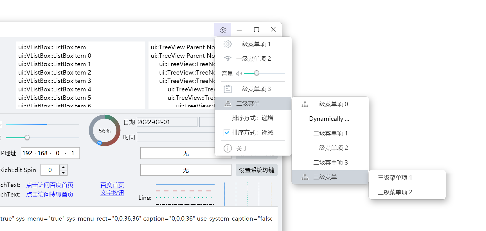

## Menu
The menu is implemented based on a window ([WindowImplBase](../duilib/Utils/WinImplBase.h)), mainly composed of two classes: [Menu](../duilib/Control/Menu.h) and [MenuItem](../duilib/Control/Menu.h).
1. Menu effect preview
This preview is the menu in the `examples/controls` example program.

2. The menu implementation includes the basic features of a system menu: icons, check boxes, multi-level menus, menu item separators, dynamically modifying menu items, inserting non-menu controls into the menu, etc.
3. The main content of `settings_menu.xml`:
```xml
<?xml version="1.0" encoding="utf-8"?>
<Window shadow_type="menu_round" shadow_attached="true" layered_window="true" >
    <MenuListBox class="menu" name="main_menu">
        <!-- Top-level menu -->
        <MenuItem class="menu_element" name="first" width="180">
          <Button name="button_01" width="auto" height="auto" bkimage="menu_settings.png" valign="center" mouse_enabled="false" keyboard_enabled="false"/>
          <Label class="menu_text" text="Top-level menu item 1" margin="30,0,0,0" mouse_enabled="false" keyboard_enabled="false"/>
        </MenuItem>
    
        <MenuItem class="menu_element" name="second" width="180">
          <Button name="button_02" width="auto" height="auto" bkimage="menu_proxy.png" valign="center" mouse_enabled="false" keyboard_enabled="false"/>
          <Label class="menu_text" text="Top-level menu item 2" margin="30,0,0,0" mouse_enabled="false" keyboard_enabled="false"/>
        </MenuItem>
        
        <!-- Insert ordinary controls into the menu for specific functions -->
        <HBox class="menu_split_box" height="36">
            <Label class="menu_text" text="Volume" textpadding="0,0,6,0" mouse_enabled="false" keyboard_enabled="false"/>
            <Control width="auto" height="auto" bkimage="menu_speaker.png" valign="center" mouse_enabled="false" keyboard_enabled="false"/>
            <Slider class="slider_green" value="70" tooltip_text="ui::Slider"/>
        </HBox>
        
        <!-- Separator between menu items -->
        <Box class="menu_split_box">
            <Control class="menu_split_line" />
        </Box>
        
        <MenuItem class="menu_element" name="third" width="180">
            <Button name="button_03" width="auto" height="auto" bkimage="menu_logs.png" valign="center" mouse_enabled="false" keyboard_enabled="false"/>
            <Label class="menu_text" text="Top-level menu item 3" margin="30,0,0,0" mouse_enabled="false" keyboard_enabled="false"/>
        </MenuItem>
        
        <MenuItem class="menu_element" name="fourth" width="180">
            <Button name="button_04" width="auto" height="auto" bkimage="menu_tree.png" valign="center" mouse_enabled="false" keyboard_enabled="false"/>
            <Label class="menu_text" text="Sub-menu" margin="30,0,0,0" mouse_enabled="false" keyboard_enabled="false"/>
            <!-- Sub-menu: first supported form (keeps backward compatibility) -->
            <MenuItem class="menu_element" name="sub_menu0" width="180">
                <Button name="button_44" width="auto" height="auto" bkimage="menu_tree.png" valign="center" mouse_enabled="false" keyboard_enabled="false"/>
                <Label class="menu_text" text="Sub-menu item 0" margin="30,0,0,0" mouse_enabled="false" keyboard_enabled="false"/>
            </MenuItem>
            <!-- Sub-menu: second supported form (new format, convenient for adding ordinary controls in sub-menus) -->
            <SubMenu>
                <MenuItem class="menu_element" name="sub_menu1" width="180">
                    <Label class="menu_text" text="Sub-menu item 1" margin="30,0,0,0" mouse_enabled="false" keyboard_enabled="false"/>
                </MenuItem>
                <MenuItem class="menu_element" name="sub_menu2" width="180">
                    <Label class="menu_text" text="Sub-menu item 2" margin="30,0,0,0" mouse_enabled="false" keyboard_enabled="false"/>
                </MenuItem>
                <MenuItem class="menu_element" name="sub_menu3" width="180">
                    <Label class="menu_text" text="Sub-menu item 3" margin="30,0,0,0" mouse_enabled="false" keyboard_enabled="false"/>
                </MenuItem>
                <MenuItem class="menu_element" name="sub_menu4" width="180">
                    <Button name="button_05" width="auto" height="auto" bkimage="menu_tree.png" valign="center" mouse_enabled="false" keyboard_enabled="false"/>
                    <Label class="menu_text" text="Third-level menu" margin="30,0,0,0" mouse_enabled="false" keyboard_enabled="false"/>
                    <!-- Third-level menu -->
                    <MenuItem class="menu_element" name="sub_sub_menu1" width="180">
                        <Label class="menu_text" text="Third-level menu item 1" mouse_enabled="false" keyboard_enabled="false"/>
                    </MenuItem>
                    <MenuItem class="menu_element" name="sub_sub_menu2" width="180">
                        <Label class="menu_text" text="Third-level menu item 2" mouse_enabled="false" keyboard_enabled="false"/>
                    </MenuItem>
                </MenuItem>
            </SubMenu>
        </MenuItem>
        
        <!-- Separator between menu items -->
        <Box class="menu_split_box">
            <Control class="menu_split_line" mouse_enabled="false" keyboard_enabled="false"/>
        </Box>
        
        <!-- Menu items with checkboxes -->
        <MenuItem class="menu_element" name="menu_check_01" width="180">
            <CheckBox class="menu_checkbox" name="menu_checkbox_01" text="Sort order: ascending" margin="0,5,0,10" selected="true" tooltiptext="ui::Checkbox" mouse_enabled="false" keyboard_enabled="false"/>
        </MenuItem>
        <MenuItem class="menu_element" name="menu_check_02" width="180">
            <CheckBox class="menu_checkbox" name="menu_checkbox_02" text="Sort order: descending" margin="0,5,0,10" selected="false" tooltiptext="ui::Checkbox" mouse_enabled="false" keyboard_enabled="false"/>
        </MenuItem>
        
        <!-- Separator between menu items -->
        <Box class="menu_split_box">
            <Control class="menu_split_line" mouse_enabled="false" keyboard_enabled="false"/>
        </Box>
    
        <MenuItem class="menu_element" name="about" width="auto">
            <Button name="button_06" width="auto" height="auto" bkimage="menu_about.png" valign="center" mouse="false" mouse_enabled="false" keyboard_enabled="false"/>
            <Label class="menu_text" text="About" margin="30,0,0,0" mouse_enabled="false" keyboard_enabled="false"/>
        </MenuItem>
  </MenuListBox>
</Window>
```

4. The main content of `submenu.xml`:
```xml
<?xml version="1.0" encoding="utf-8"?>
<Window shadow_type="menu_round" shadow_attached="true" layered_window="true">
  <MenuListBox class="menu" name="submenu">
   
  </MenuListBox>
</Window>
```
`submenu.xml` is the configuration file of the sub-menu; it can be modified through the `Menu::SetSubMenuXml` interface:
```cpp
/** Set the XML template file and properties of the multi-level sub-menu
@param [in] submenuXml the XML template file name of the sub-menu; if not set, defaults to "submenu.xml" internally
@param [in] submenuNodeName the node name in the sub-menu XML file where sub-menu items are inserted; if not set, defaults to "submenu" internally
*/
void SetSubMenuXml(const std::wstring& submenuXml, const std::wstring& submenuNodeName);
```
5. Code snippet for showing the menu in the `examples/controls` example program    
Show the menu, and add sub-menu items to the second-level menu:
```cpp
void ControlForm::ShowPopupMenu(const ui::UiPoint& point, ui::Control* pRelatedControl)
{
    ui::Menu* menu = new ui::Menu(this, pRelatedControl);// the parent window must be set; otherwise the program status bar becomes inactive when the menu pops up
    menu->SetSkinFolder(GetResourcePath().ToString());
    DString xml(_T("menu/settings_menu.xml"));
    menu->ShowMenu(xml, point);

    // add sub-menu items to a sub-menu
    ui::MenuItem* menu_fourth = static_cast<ui::MenuItem*>(menu->FindControl(_T("fourth")));
    if (menu_fourth != nullptr) {
        ui::MenuItem* menu_item = new ui::MenuItem(menu);
        menu_item->SetText(_T("Dynamically created"));
        menu_item->SetClass(_T("menu_element"));
        menu_item->SetFixedWidth(ui::UiFixedInt(180), true, true);
        menu_item->SetFontId(_T("system_14"));
        menu_item->SetTextPadding({ 20, 0, 20, 0 }, true);
        menu_fourth->AddSubMenuItemAt(menu_item, 1);// after adding, the resources are managed by the menu
    }
```

Add the response function associated with the menu item:
```cpp
    /* About menu */
    ui::MenuItem* menu_about = static_cast<ui::MenuItem*>(menu->FindControl(_T("about")));
    if (menu_about != nullptr) {
        menu_about->AttachClick([this](const ui::EventArgs& args) {
            AboutForm* about_form = new AboutForm();
            ui::WindowCreateParam createParam;
            createParam.m_dwStyle = ui::kWS_POPUP;
            createParam.m_dwExStyle = ui::kWS_EX_LAYERED;
            createParam.m_windowTitle = _T("AboutForm");
            createParam.m_bCenterWindow = true;
            about_form->CreateWnd(this, createParam);
            about_form->ShowModalFake();
            return true;
            });
    }
}
```
